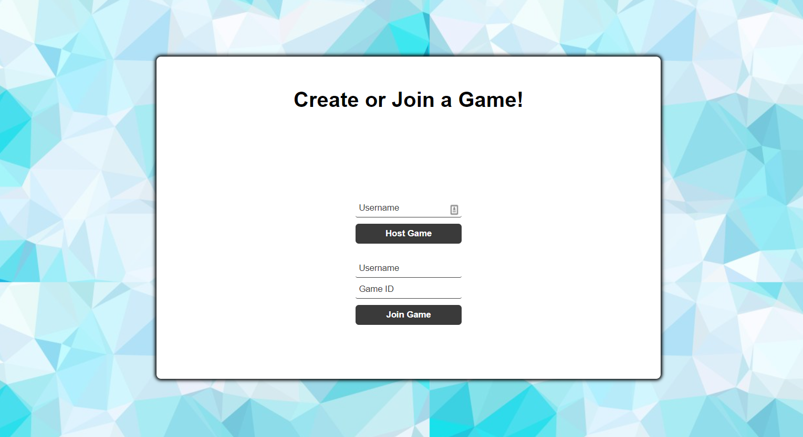
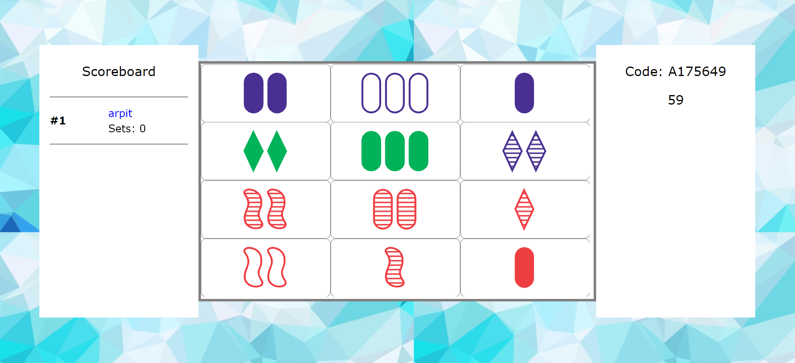

# Speed Set
A fun twist on the game of Set, this version removes unfair mechanics that the in-persion version has.

[Check it out here!](speedset.herokuapp.com)

Players can rather host a game or join a room hosted by a friend using a room code.

Once the host starts the game, it's a mad dash to see who can get the most sets. 

In this version of the game, players are served the same sets of cards sequentially so that nobody has an unfair advantage.
Created using Node.js and vanilla JavaScript with HTML & CSS. 
